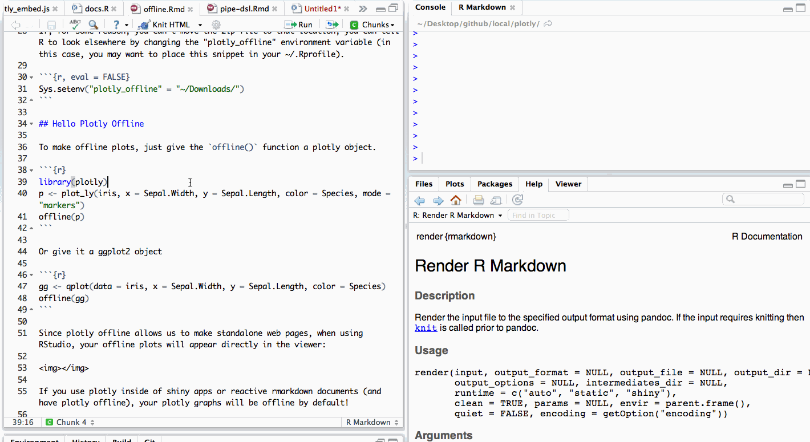

```{r, echo = FALSE}
knitr::opts_chunk$set(message = FALSE)
```

## Setup plotly offline

When you purchase [plotly offline](http://purchasing.plot.ly/), you'll receive a personal download link to a zip file named plotlyjs.zip. Once downloaded, just move that file to your `~/.plotly` directory.

```{r, eval = FALSE}
if (!dir.exists("~/.plotly")) dir.create("~/.plotly")
file.rename("~/Downloads/plotlyjs.zip", "~/.plotly/plotlyjs.zip")
```

If, for some reason, you can't move the zip file to that location, tell R to look elsewhere by changing the "plotly_offline" environment variable (in this case, you may want to place this snippet in your ~/.Rprofile).

```{r, eval = FALSE}
Sys.setenv("plotly_offline" = "~/Downloads/")
```

## Hello Plotly Offline

To make offline plots, just give the `offline()` function a plotly object.

```{r}
library(plotly)
p <- plot_ly(iris, x = Sepal.Width, y = Sepal.Length, color = Species, mode = "markers")
offline(p)
```

Or give it a ggplot2 object

```{r}
gg <- qplot(data = iris, x = Sepal.Width, y = Sepal.Length, color = Species)
offline(gg)
```

Since plotly offline allows us to make standalone web pages, when using RStudio, your offline plots will appear directly in the viewer:

<div align = "center">
  
</div>

If you use plotly inside of shiny apps or reactive rmarkdown documents (and have plotly offline), your plotly graphs will be offline by default!

```{r, eval = FALSE}
shiny::runApp(system.file("examples/UN_Simple", package = "plotly"))
```
