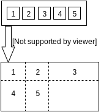
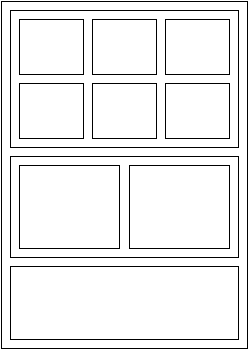

```{r, echo = FALSE}
knitr::opts_chunk$set(
  message = FALSE, 
  warning = FALSE,
  comment = "#>",
  fig.width = 7
)
# someday we may want to do pngs to reduce size...
# printly <- function(p, options, ...) { 
#   p <- layout(p, height = options$fig.height, width = options$fig.width)
#   u <- plotly::plotly_POST(p, filename = Sys.time())$url
#   sprintf(
#     "<a href='%s'>  </a>", 
#     u, u, "max-width:100%"
#   )
# }
# assignInNamespace("knit_print.plotly_hash", printly, asNamespace("plotly"))
# assignInNamespace("knit_print.plotly_built", printly, asNamespace("plotly"))
```

## Introduction

The `subplot()` function provides a flexible interface for arranging multiple **plotly** plots in a single view. The simplest way to use it is to pass plotly visualizations directly to `subplot()`.

```{r}
library(plotly)
p1 <- plot_ly(economics, x = date, y = unemploy, name = "unemploy")
p2 <- plot_ly(economics, x = date, y = uempmed, name = "uempmed")
subplot(p1, p2)
```

Although `subplot()` accepts an arbitrary number of plot objects, passing a _list_ of plots can save typing and redundant code when dealing with a large number of plots. To demonstrate, let's create one time series for each variable in the `economics` dataset and share the x-axis so that zoom/pan events are synchronized across each series:

```{r, fig.height = 5}
vars <- setdiff(names(economics), "date")
plots <- lapply(vars, function(var) {
  plot_ly(x = economics$date, y = economics[[var]], name = var)
})
subplot(plots, nrows = length(plots), shareX = TRUE, titleX = FALSE)
```

```{r, echo = FALSE, eval = FALSE}
# this works too, but I'm not sure we should advertise...
elong <- tidyr::gather(economics, variable, value, -date)
elong$id <- as.integer(factor(elong$variable))
p <- plot_ly(elong, x = date, y = value, group = variable, yaxis = paste0("y", id))
subplot(p, nrows = 5, shareX = TRUE)
```

Conceptually, `subplot()` provides a way to place a collection of plots into a table with a given number of rows and columns. The number of rows (and, by consequence, the number of columns) is specified via the `nrows` argument. By default each row/column shares an equal proportion of the overall height/width, but as shown in the diagram below, that default can be changed via the `heights` and `widths` arguments.

<div align = "center">
  
</div>

This flexibility is quite useful for a number of visualizations, for example, a joint density plot (the new [heatmaply](https://github.com/talgalili/heatmaply) package is another good example).

```{r}
x <- rnorm(100)
y <- rnorm(100)
m <- list(color = "black")
s <- subplot(
  plot_ly(x = x, type = "histogram", marker = m), 
  plotly_empty(), 
  plot_ly(x = x, y = y, mode = "markers",  marker = m), 
  plot_ly(y = y, type = "histogram", marker = m),
  nrows = 2, heights = c(0.2, 0.8), widths = c(0.8, 0.2), 
  shareX = TRUE, shareY = TRUE, titleX = FALSE, titleY = FALSE
)
layout(s, showlegend = FALSE)
```

Note that, since `subplot()` returns a plotly object, any [layout attribute](https://plot.ly/r/reference/#layout) can be modified downstream via `layout()`.

## Recursive subplots

The `subplot()` function is designed to work recursively so that you can have subplots of subplots. This idea is useful when your desired layout doesn't conform to the table structure described in the previous section. In fact, you can think of a subplot of subplots like a spreadsheet with merged cells.

<div align = "center">
  
</div>

```{r, fig.height = 5}
plotList <- function(nplots) {
  # TODO: use new images infrastructure to overlay an R image on each plot
  lapply(seq_len(nplots), function(x) plot_ly())
}
s1 <- subplot(plotList(6), nrows = 2, shareX = TRUE, shareY = TRUE)
s2 <- subplot(plotList(2), shareY = TRUE)
subplot(s1, s2, plot_ly(), nrows = 3, margin = 0.04, heights = c(0.6, 0.3, 0.1))
```

The concept is particularly useful when you want plot(s) in a given row to have different widths from plot(s) in another row.

```{r, fig.height = 6}
# specify some map projection/options
g <- list(
  scope = 'usa',
  projection = list(type = 'albers usa'),
  lakecolor = toRGB('white')
)
# create a map of population density
density <- state.x77[, "Population"] / state.x77[, "Area"]
map <- plot_ly(
  z = density, 
  text = state.name, locations = state.abb,
  type = 'choropleth', locationmode = 'USA-states', geo = "geo"
) %>% layout(geo = g)
# create a bunch of horizontal bar charts 
vars <- colnames(state.x77)
barcharts <- lapply(vars, function(var) {
  plot_ly(x = state.x77[, var], y = state.name, type = "bar", 
          orientation = "h", name = var) %>%
    layout(showlegend = FALSE, hovermode = "y",
           yaxis = list(showticklabels = FALSE))
})
subplot(
  subplot(barcharts, margin = 0.01), map, 
  nrows = 2, heights = c(0.3, 0.7)
)
```

## ggplot2 subplots

The `subplot()` function also understands ggplot2 objects, and converts them to an interactive web-based version via `ggplotly()` before arranging them in the final layout.

```{r, fig.height = 6}
e <- tidyr::gather(economics, variable, value, -date)
gg1 <- ggplot(e, aes(date, value)) + geom_line() +
  facet_wrap(~variable, scales = "free_y", ncol = 1)
gg2 <- ggplot(e, aes(factor(1), value)) + geom_violin() +
  facet_wrap(~variable, scales = "free_y", ncol = 1) + 
  theme(axis.text = element_blank(), axis.ticks = element_blank())
subplot(gg1, gg2) %>% layout(margin = list(l = 50))
```

This infrastructure allows `ggplotly()` to understand ggmatrix 
objects -- the class of object returned by the `ggpairs()` function in the 
**GGally** package.

```{r, fig.height = 5}
pm <- GGally::ggpairs(iris)
ggplotly(pm)
```


